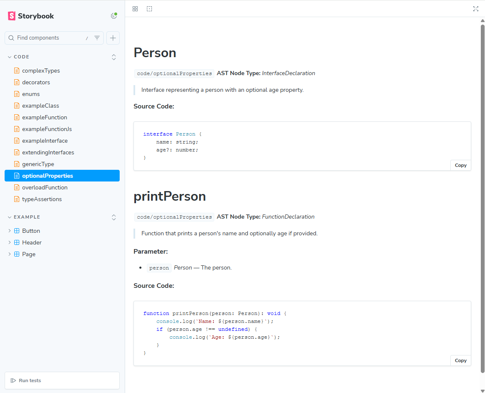

# Storybook Addon: JSDoc to MDX

<div align="center">
  
  <br/>
</div>
<hr/>

## Description

This Storybook addon automatically scans your project for JavaScript or TypeScript files, extracts JSDoc comments, and generates comprehensive MDX documentation. It integrates seamlessly with Storybook, enhancing your component documentation with detailed insights and examples extracted directly from your source code.

For example, the following TypeScript code:

```typescript
/**
 * Interface representing a person with an optional age property.
 */
interface Person {
    name: string;
    age?: number;
}

/**
 * Function that prints a person's name and optionally age if provided.
 * @param {Person} person The person.
 */
function printPerson(person: Person): void {
    console.log(`Name: ${person.name}`);
    if (person.age !== undefined) {
        console.log(`Age: ${person.age}`);
    }
}
```

will be shown in the Storybook as follows




## Table of Contents

1. [Requirements](#requirements)
2. [Installation](#installation)
3. [Usage](#usage)
4. [Configuration](#configuration)
5. [Features](#features)
6. [Future Plans and Development](#future-plans-and-development)
7. [Contribution](#contribution)
8. [License](#license)
9. [Acknowledgments](#acknowledgments)

## Requirements

- Storybook@>=7.0.0

This addon should work well with any framework. If you find that the addon does not work, please open an issue.

## Installation

To install the addon, run the following command in your terminal:

```bash
npm install storybook-addon-jsdoc-to-mdx --save-dev
```

Or if you prefer using Yarn:

```bash
yarn add storybook-addon-jsdoc-to-mdx --dev
```

## Usage

After installation, add the addon to your `.storybook/main.js` configuration file:

```javascript
module.exports = {
  addons: [
    // other addons
    {
      name: 'storybook-addon-jsdoc-to-mdx',
      options: {
        folderPaths: ['./src/'], // paths to folders with JS/TS code
        extensions: ['ts', 'js'] // file extensions to include
      }
    }
  ]
};
```

## Configuration

The addon can be configured with the following options:

- `folderPaths`: An array of paths to folders containing your source files.
- `extensions`: An array of file extensions to be included in the documentation generation process.

## Features

- **Automatic MDX Generation**: Converts JSDoc comments into MDX files that Storybook can display as documentation.
- **Supports Multiple File Types**: Works with both JavaScript and TypeScript files.
- **Customizable Path and Extension**: You can specify which directories and file types to include.

## Future Plans and Development

I am always looking to improve and expand the capabilities of my Storybook addon. Some of the features I'm considering for future development include:

- **Custom Documentation Templates**: Allowing users to define their own templates for the generated documentation, giving them more control over the presentation of their JS/TS code in Storybook.
- **AI-powered JSDoc Generation**: Exploring the integration of advanced AI (like Large Language Models) to automatically generate JSDoc comments for your code, making the documentation process even more seamless.

## Contribution

Contributions are welcome! If you'd like to contribute, please fork the repository and use a feature branch. Pull requests are warmly welcome.

## License

This project is licensed under the MIT License - see the [LICENSE.md](./LICENSE.md) file for details.

## Acknowledgments

- Thanks to the Storybook community for the continuous support and inspiration.
- Special thanks to everyone who contributed to making this addon better.
